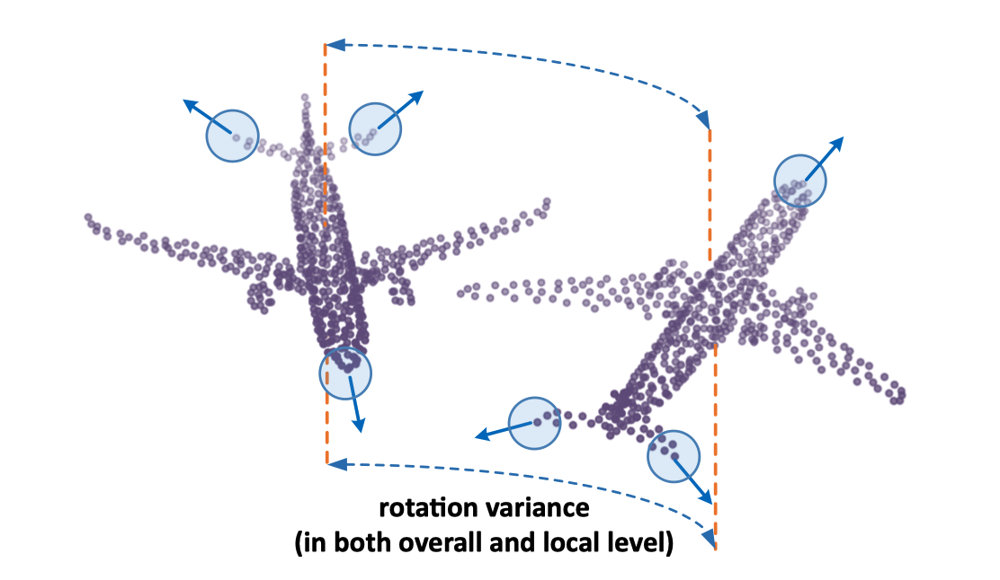

In this work, we proposed a method of hierarchically aligning point cloud to local tangent space, which could be easily applied to multiple mainstream point cloud networks and make them invariant to arbitrary rotation. Our method outperformed the prior art remarkably.

Download our paper [here](https://thu17cyz.github.io/files/pointalign.pdf)

View our project code [here](https://github.com/THU17cyz/PointAlign)
