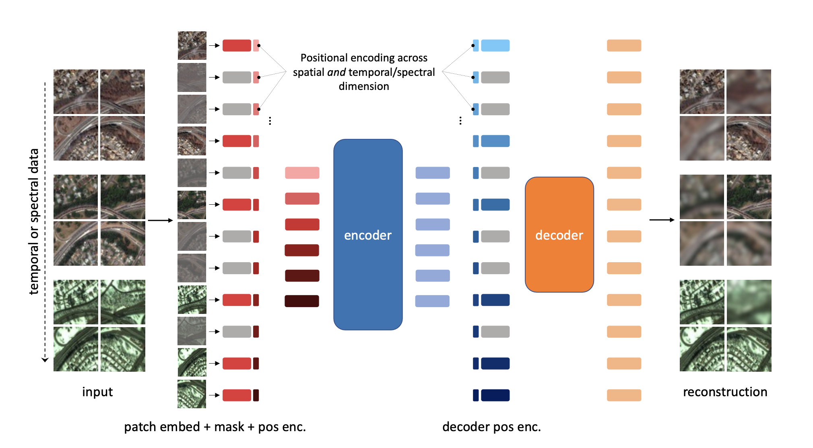

*Accepted by the Thirty-sixth Conference on Neural Information Processing Systems (NeurIPS 2022)*

Unsupervised pre-training methods for large vision models have shown to enhance performance on downstream supervised tasks. Developing similar techniques for satellite imagery presents significant opportunities as unlabelled data is plentiful and the inherent temporal and multi-spectral structure provides avenues to further improve existing pre-training strategies. In this paper, we present SatMAE, a pre-training framework for temporal or multi-spectral satellite imagery based on Masked Autoencoder (MAE). To leverage temporal information, we include a temporal embedding along with independently masking image patches across time. In addition, we demonstrate that encoding multi-spectral data as groups of bands with distinct spectral positional encodings is beneficial. Our approach yields strong improvements over previous state-of-the-art techniques, both in terms of supervised learning performance on benchmark datasets (up to ↑ 7%), and transfer learning performance on downstream remote sensing tasks, including land cover classification (up to ↑ 14%) and semantic segmentation.

Related links: 

* Download our paper [here](https://arxiv.org/abs/2207.08051)

* Our project website is [here](https://sustainlab-group.github.io/SatMAE/)

* View our project code [here](https://github.com/sustainlab-group/SatMAE)
